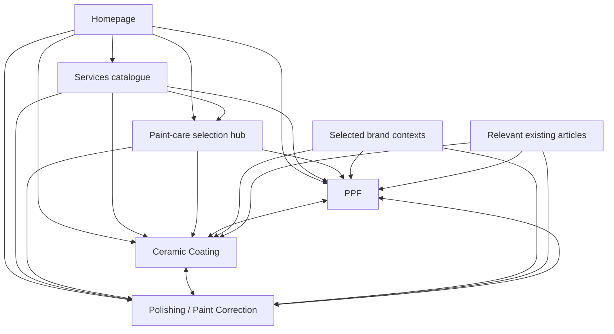

# DIGI-TEC paint-care cluster — combined integration report

Completed locally on 8 September 2026. No deployment, publishing or commit was performed.

The three existing commercial pages now form a connected cluster with a distinct service-selection hub. All three are one click from the homepage, appear in the Services catalogue and have contextual HTML inbound links. The final checks used the same coordinated root `dist` build, including the concurrent Local SEO additions.

## 1. Final canonical URLs

| Role | Canonical |
| --- | --- |
| PPF commercial page | `https://digitecme.com/services/paint-protection-film` |
| Ceramic commercial page | `https://digitecme.com/services/ceramic-coating` |
| Polishing and correction commercial page | `https://digitecme.com/services/car-polishing-dubai` |
| Paint-care service-selection hub | `https://digitecme.com/services/paint-protection-dubai` |
| Informational comparison | `https://digitecme.com/blog/ceramic-coating-vs-ppf-dubai` |

These are the intended production canonicals in the tested local output. This report does not claim the changes are live.

## 2. Final keyword ownership

| Keyword / intent | Canonical owner | Supporting pages | Pages that must retain a different purpose |
| --- | --- | --- | --- |
| PPF Dubai; Paint Protection Film Dubai | `/services/paint-protection-film` | Services, paint-care hub, relevant brands and comparison article | Paint-care hub selects services; Ceramic and Polishing explain complementary work |
| Full Body PPF Dubai | PPF page, especially `#ppf-coverage` | Brand paint-protection contexts | No separate full-body page until evidence justifies it |
| PPF Price Dubai | PPF page, `#ppf-cost` | Coverage options and quote form | No separate price landing page |
| Ceramic Coating Dubai | `/services/ceramic-coating` | Services, hub, selected brands and two relevant articles | Benefits and comparison articles remain informational |
| Ceramic Coating Price Dubai | Ceramic page, `#ceramic-cost` | Coating options and enquiry CTAs | No separate ceramic-price page |
| Car Polishing Dubai | `/services/car-polishing-dubai` | Homepage, Services, hub, selected brands and articles | The broad hub should not be positioned as a second polishing landing page |
| Paint Correction Dubai | `/services/car-polishing-dubai` | PPF/Ceramic preparation links and body-repair context | No second correction commercial page |
| Swirl Mark Removal Dubai | Polishing/correction page | Defect explanation, assessment and related preparation content | No separate thin swirl-removal page |
| PPF vs Ceramic Coating | `/blog/ceramic-coating-vs-ppf-dubai` | Concise comparisons on PPF/Ceramic pages | Commercial page comparisons support choosing a service; their primary intent stays commercial |
| Broad paint-care / protection selection | `/services/paint-protection-dubai` | Homepage and Services | Hub copy directs customers to the three specialist pages |

Price, full-body, scratch and swirl subtopics stay with their current commercial owner until Search Console and conversion evidence support a separate URL. No new supporting, brand-by-service or location page was created.

The service titles and H1s remain:

| Page | Title tag | H1 |
| --- | --- | --- |
| PPF | PPF Dubai \| Paint Protection Film for Cars \| DIGI-TEC | Paint Protection Film (PPF) Dubai |
| Ceramic | Ceramic Coating Dubai \| Car Paint Protection \| DIGI-TEC | Ceramic Coating Dubai |
| Polishing/correction | Car Polishing & Paint Correction Dubai \| DIGI-TEC | Car Polishing & Paint Correction Dubai |

## 3. Cannibalization and integration issues found

- The broad hub's H1 began with “Paint Correction”, giving correction undue prominence within a page covering several services.
- The older coating-benefits article used a broad commercial-style title. Some of its body claims conflicted with the new service page: mandatory coating, fixed curing times, universal paint correction and guaranteed protection against etching.
- Polishing was initially absent from the Services experience. The Local SEO workstream added the English-only discovery record and Services/HTML-sitemap integration during this audit; these additions were retained and validated.
- The homepage still needed the new English-only service card.
- Some preparation links originally pointed at the broad hub. The arriving Local SEO changes corrected the PPF preparation destination and added the hub's polishing link; the combined checks confirm both.
- Brand paint-care paragraphs linked PPF but left coating and correction as unlinked concepts. The wording was largely repeated across the nine brands.
- The three visible breadcrumb labels did not consistently match their `BreadcrumbList` labels. The Polishing breadcrumb said “Paint care”, which could be mistaken for the broader hub.
- Polishing's submit button was initially active without JavaScript, unlike the PPF form. Its pending state also needed a reset when the browser restored the page after leaving for WhatsApp.

These are source/architecture findings. Search Console was not available, so no claim is made that Google was already selecting the wrong page.

## 4. Cannibalization fixes made

The broad hub H1 is now **“Car Paint Care & Protection Options in Dubai”**. Its existing broader title and canonical remain. Its body explains the different roles and links to all three commercial owners.

The coating-benefits article now uses **“Ceramic Coating in the UAE: Benefits & Preparation | DIGI-TEC”** with an informational meta description. Its relevant unsupported statements were qualified so an article-to-service journey gives consistent advice. The comparison article now frames coverage as a choice and correction as condition-dependent, and links to the appropriate services.

The site-wide scan of English indexable titles/H1s found five relevant candidates: the three commercial pages, the comparison article and the benefits/preparation article. Their roles are distinct. The three commercial title tags and descriptions are unique across the full rendered route set. No useful page was noindexed, redirected or canonicalized away merely for mentioning the same subject.

## 5. Services hub and homepage integration

The existing `englishOnlyServices` discovery record is included in the English Services catalogue and its `ItemList` schema, exactly once. PPF and Ceramic cards still point directly to their canonical service pages. The broad paint-care hub remains a separate selection option.

The homepage's existing Body & Visual Work group now also includes Polishing/Paint Correction. This uses the existing card layout and service data, without adding a new homepage section. Its direct link makes each of the three commercial pages one click from Home.

Arabic Services, homepage and HTML-sitemap output do not contain an invented `/ar/services/car-polishing-dubai` link. The existing Arabic PPF and Ceramic routes remain intact. Polishing continues to use the Arabic Services fallback for language switching.

## 6. Paint-care hub integration

`/services/paint-protection-dubai` remains indexable with its own canonical. It now functions as a selection page:

- Polishing/correction for assessed existing surface defects.
- PPF for physical protection on covered panels.
- Ceramic coating for product-dependent surface behaviour and maintenance.

Its contextual links lead directly to all three specialist pages. Each specialist page also links back to the broader options hub. No compulsory correction or compulsory protection purchase is implied by the cluster.

## 7. PPF outgoing and incoming integration

The existing PPF design, service claims, coverage discussion, FAQs and quote form are preserved. Its correction link leads to the combined polishing page; the comparison links to Ceramic and the existing guide remain. A compact contact-area link returns to the paint-care hub. About, contact and all nine brand links remain available.

Final PPF discovery: **17 unique content sources and 18 link instances**, including Home, Services, HTML sitemap, the hub, Ceramic, Polishing, body repair, nine brand pages and the comparison article.

Full-body, front and selected-panel coverage records now accept verified starting-price fields. No amount is currently populated or rendered. A conditional real-project component is ready for documented PPF work.

## 8. Ceramic outgoing and incoming integration

Ceramic retains its preparation link to Polishing/Paint Correction and its PPF comparison link. A compact contact-area link returns to the paint-care hub. The nine existing brand links remain. Its primary quote CTAs stay service-specific.

Final Ceramic discovery: **13 unique content sources and 14 link instances**, including Home, Services, HTML sitemap, the hub, PPF, Polishing, body repair, BMW, Lamborghini, Rolls-Royce, Range Rover and both paint-care articles.

The cost section now has a conditional verified starting-price slot. It requires no layout redesign when approved pricing becomes available. A conditional component supports genuine future coating projects.

## 9. Polishing outgoing and incoming integration

Polishing retains its Ceramic and PPF aftercare links, body-repair link for deeper damage, broad hub link, About link and nine brand links. Its existing assessment-to-correction-to-optional-protection journey is preserved.

Final Polishing discovery: **13 unique content sources and 13 link instances**, including Home, Services, HTML sitemap, the hub, PPF, Ceramic, body repair, Mercedes-Benz, Porsche, Ferrari, Aston Martin and both relevant articles. It is no longer dependent on XML sitemap discovery.

The form now disables submission until JavaScript is ready and resets its pending state on `pageshow`. The visible breadcrumb names the actual polishing/correction page. Its existing verified-pricing fields, conditional before/after component and photo-led enquiry flow remain; the project model now also supports an existing brand page and optional documented case-study route.

## 10. Brand and blog link decisions

The nine brands already had an explicit paint-care context. Those existing sections were refined, with distinct copy and selective destinations:

| Brand | Contextual destinations |
| --- | --- |
| Mercedes-Benz | PPF + paint assessment/correction |
| Porsche | PPF + polishing/correction |
| Ferrari | PPF + correction limits |
| Aston Martin | PPF + restoring paint clarity |
| BMW | PPF + ceramic coating |
| Lamborghini | PPF + coating options |
| Rolls-Royce | PPF + ceramic paint protection |
| Range Rover | PPF + coating preparation/maintenance |
| McLaren | PPF + the informational film/coating comparison |

No brand receives an automatic three-service grid. Example anchors include “a paint assessment”, “restoring paint clarity”, “coating options” and “PPF coverage options”. The relevant paragraph explains the relationship rather than listing keywords.

The comparison article links to PPF and Ceramic in its introductory explanation and to correction near the paint-condition discussion. The coating-benefits article links to correction and Ceramic at its preparation/workshop section. A small optional paragraph-link field supports these crawlable links without raw HTML, broad automatic keyword linking or changes to unrelated article content.

## 11. Final internal-link map and crawl depth

All three specialist pages also return to the paint-care hub. Body repair links to correction where a surface mark may be suitable for polishing; correction links back to body repair for deeper damage. The HTML sitemap provides an additional crawlable path.

| Commercial page | Shortest path | Clicks | Other useful paths | Unique HTML content sources |
| --- | --- | ---: | --- | ---: |
| PPF | Home → PPF | 1 | Home → Services → PPF; Home → Hub → PPF | 17 |
| Ceramic | Home → Ceramic | 1 | Home → Services → Ceramic; Home → Hub → Ceramic | 13 |
| Polishing/correction | Home → Polishing | 1 | Home → Services → Polishing; Home → Hub → Polishing | 13 |

Counts describe the final architecture, not newly added links. They count unique rendered source URLs after excluding site header/footer markup and self-links. They include the HTML sitemap and catalogue pages. The underlying [crawl report](C:/Users/ADMIN/Documents/ChatGPT/DIGITEC/docs/seo/paint-care-cluster-audit.json) lists every source and extracted anchor.

## 12. Schema, canonicals, redirects and sitemap

All three service entities reference **`https://digitecme.com/#business`**. Their global business objects match exactly, including name, automotive business type, address and telephone. Organization, WebSite, WebPage, Service, BreadcrumbList and image identifiers were checked; no extra business identity was introduced.

Visible breadcrumbs now match schema: Home → Services → the actual service name. Links are crawlable. The longer Polishing and PPF labels wrap on narrow screens. No artificial keyword breadcrumb level was added.

Fourteen relevant English/Arabic legacy aliases were tested through the generated worker. All return a **single permanent 308** to the appropriate PPF, Ceramic or broad hub canonical, preserving locale and query parameters. Their destinations are valid routes and are not further aliases. The legacy Ceramic alias leads to Ceramic, and the PPF aliases lead to PPF. No separate polishing alias was needed.

The runtime `_redirects` and worker rules were regenerated by the coordinated build. The existing migration CSV is also generated by the project pipeline; its 301 notation is separate from the verified 308 runtime policy. Neither is a temporary redirect.

The generated sitemap contains each of the four intended English canonicals once, excludes redirect-only aliases and retains valid translated routes. The working-tree public sitemap exactly matches the final build's sitemap. Modification dates reflect the changed English hub, service, brand, article and sitemap pages without changing the global release date.

## 13. Conversion, forms and analytics

PPF keeps its quote flow, Ceramic its coating quote CTAs, and Polishing its assessment/photo flow. They share a clear primary enquiry action, prominent WhatsApp access and a phone alternative. Related-service links remain compact and contextual in preparation, comparison and aftercare sections.

The PPF and Paint forms keep separate IDs, accessible labels and service context. Required values, whitespace, invalid years and their respective selector values were tested. Both are disabled without JavaScript; pressing Enter with populated fields did not perform a GET navigation or expose entered values in the URL. Direct WhatsApp and phone alternatives remain available.

All **18 page-specific WhatsApp anchors** were activated across the three pages, including keyboard and mobile-only controls. Each produced one `whatsapp_click` and the existing delegated GA4 contact event. Form submission produced one `quote_started` per form interaction, one sanitized WhatsApp click and one service-specific draft event, without a second delegated anchor event.

The shared Analytics and WhatsApp tracking files are unchanged from the integration baseline. Assertions confirmed that vehicle details and WhatsApp message text were absent from event payloads and contact URLs were sanitized. External requests were blocked during browser tests, so no enquiry was sent and no production analytics endpoint received test activity. A draft-open event remains an enquiry-intent signal, not proof of a sent or qualified lead.

## 14. Pricing and real-project readiness

PPF coverage records and Ceramic's cost section now use optional `fromAed` / `priceSource` fields and a small shared formatter. A positive finite price requires a source record before it displays. Polishing's existing equivalent guard is preserved. No amount, discount, invented package or placeholder “AED” value is rendered.

PPF and Ceramic have an empty, conditional real-project collection with service, vehicle, brand route, initial condition, actual work, outcome, image dimensions and provenance. Polishing retains its matched before/after model and gains brand/case-study linking fields. Optional project URLs must refer to real existing case-study routes; no route or job is generated automatically.

All current project collections remain empty. No workshop photograph has been relabelled as a verified coating, film or correction job. Populated project-card visual QA and approved price/inclusion review remain necessary when actual business data is supplied.

## 15. Combined technical and browser QA

The full declared pipeline ran against the shared checkout and generated the final root production artifacts. Its source fingerprint was stable throughout the successful build:

`544cf6819269e25122073c47cf17d95b58885d45e38d9e0e3c5327a2bea9b52b`

| Check | Result |
| --- | --- |
| Production client build and SSR build | Passed |
| Prerender | 1,438 real React routes |
| Sitemap / existing SEO validator | Passed; 1,158 canonical URLs |
| Hosting rules | 263 permanent redirects generated; routing tests passed |
| Focused PPF validator | Passed |
| Focused Polishing validator | Passed |
| Combined protection-release validator | Passed |
| Cluster crawler | Passed; 1,438 routes scanned, 19 relevant pages crawled, 98 local images checked |
| Commercial metadata uniqueness and shared business graph | Passed |
| Relevant alias/locale checks | 14 single-hop permanent redirects passed |
| TypeScript app check, no emit | Passed |
| Relevant ESLint | Zero errors; one pre-existing BrandPage hook warning |
| Combined SPA routing browser checks | Passed, including reloads, tagged URLs, redirects, back/forward and real 404 handling |
| Desktop/mobile journey checks | Passed at 1440, 390 and 320 px |
| Dark/light presentation, FAQs and images | Passed; screenshots reviewed |
| Both forms and five enquiry journeys | Passed |
| No-JavaScript service output | Passed; substantive content, links and safe enquiry alternatives |
| Runtime/hydration errors and horizontal overflow on the three service pages | None observed |
| Duplicate WhatsApp events / entered data in analytics | None observed |

The existing BrandPage warning concerns an unchanged conditional object used in hook dependencies; no new lint warning was introduced. Existing nonfatal build warnings remain outside this integration's edits. The local shell's initial esbuild read restriction was resolved by the approved local build execution; the successful run completed all nine declared steps.

The crawl found one existing [external Unsplash image](https://images.unsplash.com/photo-1486262715619-67b85e0b08d3?w=800&h=600&fit=crop) used elsewhere in the relevant page set; its ongoing availability falls outside the local-file validation. The three commercial pages' own images decoded successfully from the final local build. No new external image was introduced.

These checks establish local implementation behaviour. They do not establish live indexing, rankings, field Core Web Vitals, real WhatsApp delivery or lead quality.

Evidence:

- [Combined build results](C:/Users/ADMIN/Documents/ChatGPT/DIGITEC/release-qa.local/build-results.json).
- [Combined release validation](C:/Users/ADMIN/Documents/ChatGPT/DIGITEC/docs/seo/protection-release-validation.json).
- [Full cluster crawl, links and ownership candidates](C:/Users/ADMIN/Documents/ChatGPT/DIGITEC/docs/seo/paint-care-cluster-audit.json).
- [Combined journey results](C:/Users/ADMIN/Documents/ChatGPT/DIGITEC/paint-care-integration-qa.local/journey-results.json).
- [SPA navigation results](C:/Users/ADMIN/Documents/ChatGPT/DIGITEC/release-qa.local/integration/browser-results.json).
- Mobile screenshots: [PPF](C:/Users/ADMIN/Documents/ChatGPT/DIGITEC/paint-care-integration-qa.local/ppf-390.png), [Ceramic](C:/Users/ADMIN/Documents/ChatGPT/DIGITEC/paint-care-integration-qa.local/ceramic-390.png), [Polishing](C:/Users/ADMIN/Documents/ChatGPT/DIGITEC/paint-care-integration-qa.local/paint-390.png).
- Light-theme views: [PPF form](C:/Users/ADMIN/Documents/ChatGPT/DIGITEC/paint-care-integration-qa.local/ppf-light.png), [Ceramic cost section](C:/Users/ADMIN/Documents/ChatGPT/DIGITEC/paint-care-integration-qa.local/ceramic-light.png), [Paint assessment](C:/Users/ADMIN/Documents/ChatGPT/DIGITEC/paint-care-integration-qa.local/paint-light.png).

## 16. File scope and concurrent-work preservation

This workstream's new files:

- [BrandPaintCareLinks.tsx](C:/Users/ADMIN/Documents/ChatGPT/DIGITEC/src/components/BrandPaintCareLinks.tsx).
- [ProtectionProjects.tsx](C:/Users/ADMIN/Documents/ChatGPT/DIGITEC/src/components/ProtectionProjects.tsx).
- [paintCareProjects.ts](C:/Users/ADMIN/Documents/ChatGPT/DIGITEC/src/data/paintCareProjects.ts).
- [verified-pricing.ts](C:/Users/ADMIN/Documents/ChatGPT/DIGITEC/src/lib/verified-pricing.ts).
- [validate-paint-care-cluster.mjs](C:/Users/ADMIN/Documents/ChatGPT/DIGITEC/scripts/validate-paint-care-cluster.mjs).
- [test-paint-care-journeys.mjs](C:/Users/ADMIN/Documents/ChatGPT/DIGITEC/scripts/test-paint-care-journeys.mjs).
- This report and its generated cluster audit JSON.

Scoped edits were made to the existing ServiceGrid, BrandPage, ServicePage, BlogPost, three service page components, PaintAssessmentForm, PaintCorrectionProjects, service/PPF/Ceramic/Paint content data, the two relevant blog data files, route-manifest dates and PPF/Paint breadcrumb CSS. The changes add relationships, supported data slots and technical fixes; the three page designs were not rebuilt.

The Local SEO workstream's arriving English-only service record, Services/HTML-sitemap updates, PPF/hub preparation links and shared production build/preview/validation tooling were adopted and checked, not replaced. That tooling ran the coordinated build and regenerated the sitemap, route guard, redirect files and SEO inventories.

Final hash comparison found **no changes across the 520 fingerprinted source/build-input files after the validated build**. Shared Analytics, WhatsApp tracking, schema helpers, App route registration, PPF quote form and Footer matched this task's starting baseline exactly. No Google Business Profile action, NAP rewrite, broad formatting, repository reset, discarded change, commit, deployment or publishing occurred.

## 17. Recommended next step

Review this integrated local release, then supply approved prices and a small set of documented real projects with matching vehicle/service/brand records. Those are content additions, not prerequisites for the corrected internal-link architecture.

Any future deployment needs separate authorization. After an authorized launch, verify indexation and query ownership in Search Console and connect enquiry-intent events to actual lead quality. Use that evidence before splitting price, coverage, correction or swirl topics into additional pages.
